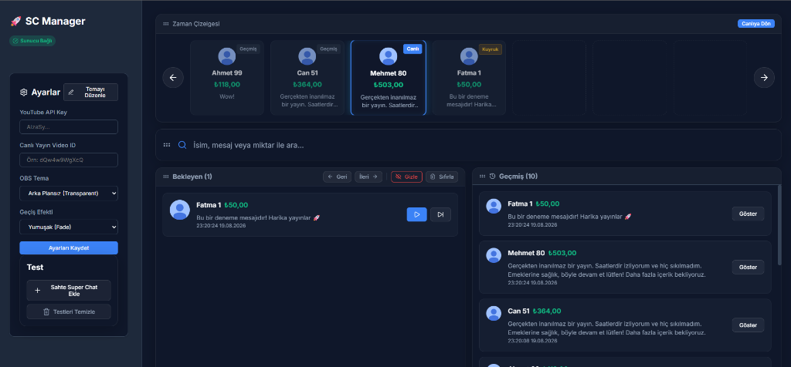
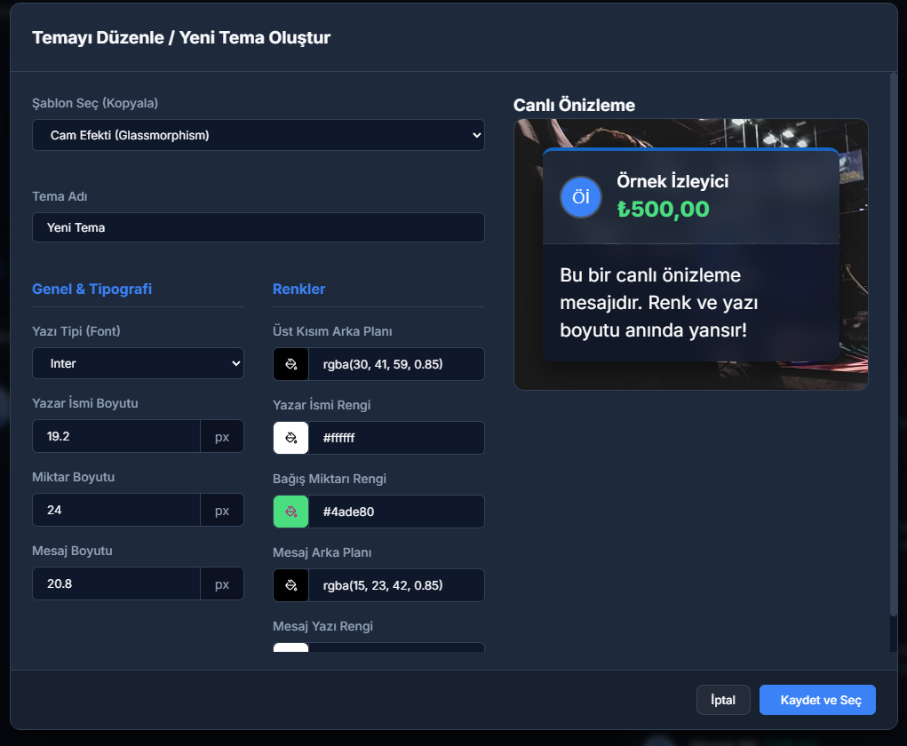

<div align="center">
  <h1>⚡ SC Manager (SuperChat Manager)</h1>
  <p>YouTube canlı yayınlarınızdaki SuperChat'leri profesyonelce yönetin ve OBS'te harika animasyonlarla sergileyin!</p>
</div>

---

## 🚀 Özellikler

- **Gerçek Zamanlı Kuyruk Sistemi:** Gelen tüm SuperChat'leri anında yakalar, kuyruğa alır ve asla gözden kaçırmanıza izin vermez.
- **Canlı Zaman Çizelgesi (Timeline):** Hangi bağışın ekranda olduğunu, sırada nelerin beklediğini ve geçmiş bağışları yenilikçi bir yatay kaydırma arayüzüyle sunar.
- **Gelişmiş Tema Düzenleyici:** "Cam Efekti" (Glassmorphism), varsayılan YouTube renkleri gibi hazır temaların yanı sıra, kendi renklerinizi, yazı tiplerinizi (Google Fonts) ve boyutlarınızı ayarlayabileceğiniz detaylı bir tema motoru.
- **Kusursuz OBS Entegrasyonu:** Tek bir lokal link üzerinden (`http://localhost:3001/overlay`) OBS Browser Source ile tam uyumlu ve şeffaf (arka plansız) çalışır. Gecikme yaşanmaz.
- **Sahte (Mock) Veri Testi:** Yayına girmeden önce animasyonlarınızı ve temanızı test edebilmeniz için tek tuşla rastgele "Sahte SuperChat" gönderme özelliği.
- **Bağımsız Masaüstü Uygulaması:** Electron altyapısıyla paketlenmiş pencereli, şık bir `.exe` deneyimi. Kurulum veya komut satırı gerektirmez.

---

## 📸 Ekran Görüntüleri

### Kontrol Paneli (Dashboard)
Yayıncının gördüğü ana yönetim ekranı. Bekleyen bağışlar, geçmiş ve aktif olan bağış anlık olarak yönetilebilir.


### Gelişmiş Tema Düzenleyici
Ekranda çıkacak bağışların tasarımını canlı önizlemeyle (Live Preview) kişiselleştirdiğiniz ekran.


---

## 🛠️ Nasıl Çalıştırılır?

Projeyi klonladıktan sonra geliştirici modunda veya dağıtım modunda çalıştırabilirsiniz:

### Geliştirici Modu (Dev)
```bash
npm install
npm start
```
Bu komut arka planda Electron penceresini açacak ve `http://localhost:3001/overlay` linkini aktif edecektir.

### Tek Tıkla Kurulum (.exe) Dosyası Üretmek
Kök dizinde bulunan `build_exe.bat` dosyasına çift tıklayarak veya konsola aşağıdaki komutu yazarak doğrudan kurulabilir bir Windows Executable (.exe) dosyası elde edebilirsiniz:
```bash
npm run dist
```
İşlem tamamlandıktan sonra oluşturulan setup dosyası `dist/` klasörüne kaydedilir.

---

## ⚙️ Teknolojiler
- **Frontend:** React, Vite, Framer Motion (Animasyonlar), Lucide-React (İkonlar)
- **Backend:** Node.js, Express, Socket.io (Gerçek zamanlı iletişim)
- **Masaüstü (Desktop):** Electron, Electron-Builder
